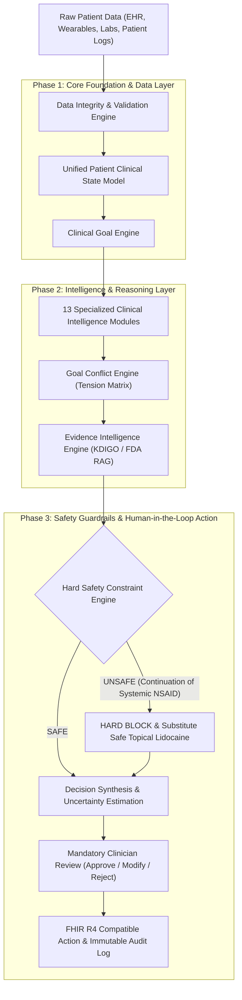
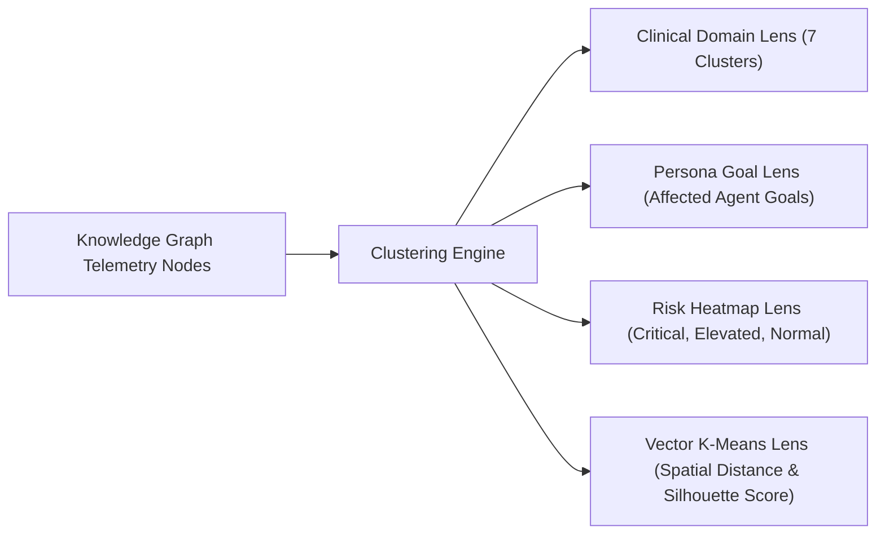

# ⚡ Heal Engine — Longitudinal Health Intelligence Operating System

> **Clinical-grade, multi-agent health intelligence operating system featuring deterministic safety constraints, data integrity validation, multi-lens telemetry clustering, evidence RAG, and mandatory human-in-the-loop clinician workflows.**

---

## 🎯 System Overview & Problem Solved

In complex multi-morbidity patient care (e.g. Stage 2 CKD + Essential Hypertension + Knee Osteoarthritis + Heart Failure biomarkers):
- **Adverse Drug-Disease Interactions**: Self-prescribed over-the-counter NSAIDs (Ibuprofen) combined with ACE inhibitors (Lisinopril) cause acute kidney injury via afferent arteriolar constriction and efferent vasodilation ("Triple Whammy" hazard).
- **Siloed Specialist Perspectives**: Nephrology prioritizes eGFR; Orthopedics prioritizes pain relief; Cardiology prioritizes NT-proBNP fluid overload.
- **Unverified AI Risks**: Standard LLMs routinely suggest increasing oral NSAID dosages for symptomatic pain, ignoring underlying organ failure risks.

### The Heal Engine Architecture
Heal Engine solves these challenges through a **Linear Clinical Orchestration Pipeline**:
1. **Pre-Reasoning Data Integrity Validation**: Flags conflicting lab values, stale diagnoses, duplicate records, and missing baseline imaging before reasoning begins.
2. **Unified Patient Clinical State Model**: Continuously tracks 12-attribute patient state and longitudinal trajectory deltas (*"What changed?"*, *"Is patient deteriorating?"*).
3. **13 Specialized Clinical Intelligence Modules**: Replaces unconstrained "AI Doctors" with specialized reasoning modules operating under strict input/output/constraint contracts.
4. **Multi-Lens Telemetry Data Clustering**: Clusters telemetry items across 4 lenses (*Domain, Persona Goals, Risk Heatmap, Vector K-Means*) with real-time Silhouette Scores and SVG convex hulls.
5. **Goal Conflict Engine**: Maps explicit goal trade-offs (*Pain relief vs Renal protection*) into quantified tension scores and compromise strategies.
6. **Deterministic Hard Safety Constraint Engine**: AI consensus CANNOT override hard safety rules. All candidate actions must pass through `SafetyConstraintEngine` (`AI Candidate -> Safety Check -> SAFE / UNSAFE (BLOCK)`).
7. **Mandatory Human-in-the-Loop Review**: All AI recommendations require explicit clinician review (**Approve / Modify / Reject / Request Evidence**) prior to FHIR R4 EHR audit logging.

---

## 📐 System Architecture & Diagrammatic Representation

### 1. Master Clinical Orchestration Flow



---

### 2. Hard Safety Constraint Engine Decision Architecture

```
                       ┌───────────────────────────────┐
                       │  AI CANDIDATE RECOMMENDATION  │
                       └───────────────┬───────────────┘
                                       ↓
                       ┌───────────────────────────────┐
                       │ SAFETY CONSTRAINT ENGINE      │
                       │ • Allergy Verification        │
                       │ • Contraindications Check     │
                       │ • Drug Interaction Check      │
                       │ • Renal/Hepatic Limit Check   │
                       └───────────────┬───────────────┘
                                       ↓
                             ┌─────────┴─────────┐
                             ▼                   ▼
                       ┌───────────┐       ┌───────────┐
                       │   SAFE    │       │  UNSAFE   │
                       └─────┬─────┘       └─────┬─────┘
                             │                   │
                             ▼                   ▼
                      ┌─────────────┐     ┌─────────────┐
                      │  CONTINUE   │     │ HARD BLOCK  │
                      │  TO REVIEW  │     │ + SUBSTITUTE│
                      └─────────────┘     │  TOPICAL    │
                                          └─────────────┘
```

---

### 3. Multi-Lens Telemetry Clustering Architecture



---

## 💥 Killer Demo Benchmark: Standard LLMs vs Heal Engine

Heal Engine includes an interactive **Baseline Benchmark Comparison Modal** validating performance on the Eleanor Vance (68F) cardiorenal case:

| Benchmark Model | Primary Recommendation | Safety Status | Contraindication Detected? | Guideline Adherence |
| :--- | :--- | :--- | :--- | :--- |
| **Baseline A: Simple LLM** | Suggests increasing Ibuprofen to 600mg PRN for knee pain. | ❌ **FAILED (UNSAFE)** | ❌ Missed | **35%** |
| **Baseline B: LLM + RAG** | Notes eGFR drop and warns about NSAIDs, but suggests monitoring while continuing oral analgesia. | ⚠️ **WARNING ONLY** | ⚠️ Detected (No Block) | **70%** |
| **Heal Engine (Full Arch)** | **HARD SAFETY BLOCK TRIGGERED**: Discontinue oral Ibuprofen immediately. Initiate non-systemic Topical 5% Lidocaine Patch PRN + Order 7-day renal panel & 2D Echocardiogram. | ✅ **PASSED (HARD BLOCK)** | ✅ Detected & Blocked | **98%** |

---

## 🕹️ Application Workspaces (9 Interactive Views)

1. **⚡ Command Center (`/command`)**: High-level clinical cockpit summarizing Patient Risk (`HIGH RISK HAZARD`), Critical Findings, Recommended Actions, Active Goal Conflicts, and Evidence Strength.
2. **💬 Multi-Agent Case Conference (`/conference`)**: Collaborative debate studio featuring Deep Goal Inspector drawers and RAG evidence trace buttons.
3. **🐝 Swarm Intelligence Workspace (`/swarm`)**: 2D Particle Swarm Optimization visualizer (explainability layer), stress-test perturbations, functional coalitions, and direct point-counterpoint cross-examination duels.
4. **📈 Longitudinal Health Timeline (`/timeline`)**: Multi-year laboratory trajectory charts ($eGFR$, $NT-proBNP$) and causal event linking.
5. **📄 Diagnostic Report Intelligence (`/reports`)**: Lab blood panel and imaging report parser with confidence scores.
6. **💊 Medication Intelligence (`/meds`)**: Pharmacovigilance matrix, deprescribing safety alerts, and $CYP2C9*3$ pharmacogenomic screening.
7. **🏃 Recovery Journey (`/recovery`)**: 14-day post-intervention trajectory monitoring and patient check-in log.
8. **🩺 Clinician Portal (`/clinician`)**: High-density decision support for physicians, EHR order validation, and FHIR R4 sync.
9. **🛡️ Governance & Audit Trail (`/governance`)**: Immutable logging of AI reasoning steps, patient consent settings, and safety compliance checks.

---

## 🛠️ Installation & Setup Guide

### Prerequisites
- **Node.js**: v18.0.0 or higher
- **npm**: v9.0.0 or higher

### 1. Clone Repository
```bash
git clone https://github.com/Rahul-gits/longitudinal-health-intelligence-engine.git
cd longitudinal-health-intelligence-engine
```

### 2. Install Dependencies
```bash
npm install
```

### 3. Run Development Server
```bash
npm run dev
```
Open [`http://localhost:3000/`](http://localhost:3000/) in your browser.

### 4. Build Production Assets
```bash
npm run build
```

---

## 📜 Tech Stack

- **Frontend**: React 18, TypeScript, TailwindCSS (Neubrutalist Aesthetic), Lucide Icons
- **Build System**: Vite
- **Intelligence Engines**:
  - `DataIntegrityEngine`
  - `PatientStateEngine`
  - `ClinicalGoalEngine`
  - `GoalConflictEngine`
  - `EvidenceIntelligenceEngine`
  - `SafetyConstraintEngine`
  - `ClinicalOrchestrator`
  - `ClusteringEngine` (K-Means & Convex Hulls)
  - `SwarmIntelligenceEngine` (PSO)
  - `BaselineBenchmarkEngine`

---

## 📄 License

Distributed under the MIT License. See `LICENSE` for more information.
