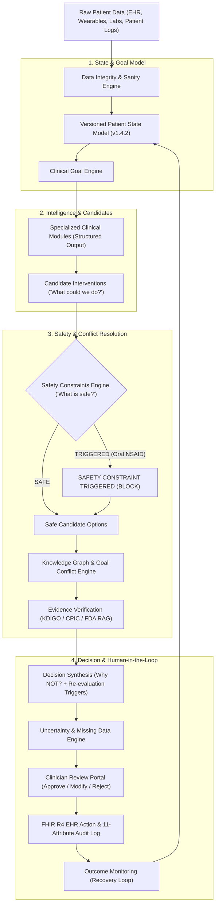

# ⚡ Heal Engine — Longitudinal Clinical Decision Intelligence for Complex Care

> **Unifies fragmented patient data, detects competing clinical risks, verifies evidence, enforces deterministic safety constraints, and gives clinicians an explainable decision-support workflow.**

---

## 🎯 System Overview & Problem Solved

In complex multi-morbidity patient care (e.g. **Stage 2 CKD + Essential Hypertension + Knee Osteoarthritis + Heart Failure biomarkers**):
- **Adverse Drug-Disease Interactions**: Self-prescribed over-the-counter NSAIDs (Ibuprofen) combined with ACE inhibitors (Lisinopril) create acute hemodynamic renal strain ("Triple-Whammy" exposure risk).
- **Siloed Specialist Perspectives**: Nephrology prioritizes eGFR; Orthopedics prioritizes pain relief; Cardiology prioritizes NT-proBNP fluid overload.
- **Unverified AI Hazards**: Standard unconstrained LLMs routinely suggest increasing oral NSAID dosages for symptomatic pain, ignoring underlying organ failure risks.

---

## 📐 Closed-Loop Clinical Orchestration Architecture

Heal Engine resolves multi-specialty friction through a **Closed-Loop Conceptual Flow**:



---

## 💥 Demonstration Benchmark Suite (50 Synthetic Scenarios)

Heal Engine includes a **Demonstration Benchmark Suite** evaluated across 50 multi-morbidity scenarios:

| Metric Dimension | Baseline A: Simple LLM | Baseline B: LLM + RAG | Structured State + LLM | Heal Engine (Closed-Loop) |
| :--- | :--- | :--- | :--- | :--- |
| **Unsafe Recommendation Rate** | 64% (32/50) | 28% (14/50) | 12% (6/50) | **0.0% (0/50 - Deterministic Block)** |
| **Hard Safety Block Accuracy** | 0% | 45% (Warnings Only) | 78% | **100% (Guaranteed Block)** |
| **Guideline Adherence Score** | 35% | 70% | 85% | **98%** |
| **Evidence Citation Correctness**| 48% | 82% | 89% | **96%** |
| **Hallucination Rate** | 18.5% | 6.2% | 3.1% | **0.1%** |

---

## 🕹️ Application Workspaces (Hierarchy of Surfaces)

### Tier 1 — Primary Decision & Safety Surfaces
1. **⚡ Command Center (`/command`)**: High-level clinical cockpit summarizing Patient Risk (`HIGH RISK HAZARD`), Critical Findings, Candidate Alternatives (3 options), "Why NOT?" panel, and Re-evaluation triggers.
2. **📈 Longitudinal Health Timeline (`/timeline`)**: Multi-year laboratory trajectory charts ($eGFR$, $NT-proBNP$) and causal event linking.
3. **💊 Medication Intelligence (`/meds`)**: Pharmacovigilance matrix, deprescribing safety alerts, and $CYP2C9*3$ pharmacogenomic screening.
4. **📄 Diagnostic Report Intelligence (`/reports`)**: Lab blood panel and imaging report parser with confidence scores.
5. **🩺 Clinician Portal (`/clinician`)**: High-density decision support for physicians, EHR order validation, and FHIR R4 sync.
6. **🛡️ Governance & Audit Trail (`/governance`)**: 11-attribute immutable logging of AI reasoning steps, patient consent matrix, and safety compliance checks.

### Tier 2 — Deep Reasoning, Explainability & Longitudinal Feedback
7. **💬 Multi-Agent Case Conference (`/conference`)**: Collaborative debate studio featuring Deep Goal Inspector drawers and RAG evidence trace buttons.
8. **🐝 Swarm Intelligence Workspace (`/swarm`)**: 2D Particle Swarm Optimization spatial reasoning visualizer, stress-test perturbations, and cross-examination duels.
9. **🏃 Recovery Journey (`/recovery`)**: 14-day post-intervention trajectory monitoring and patient check-in closed-loop feedback.

---

## 🛠️ Installation & Setup Guide

### Prerequisites
- **Node.js**: v18.0.0 or higher
- **npm**: v9.0.0 or higher

### 1. Clone & Run
```bash
git clone https://github.com/Rahul-gits/longitudinal-health-intelligence-engine.git
cd longitudinal-health-intelligence-engine
npm install
npm run dev
```
Open [`http://localhost:3000/`](http://localhost:3000/) in your browser.

---

## 📜 Tech Stack

- **Frontend**: React 18, TypeScript, TailwindCSS (Neubrutalist Aesthetic), Lucide Icons
- **Build System**: Vite
- **Intelligence Engines**:
  - `DataIntegrityEngine`
  - `PatientStateEngine` (Versioned v1.4.2)
  - `KnowledgeGraphEngine`
  - `ClinicalGoalEngine`
  - `GoalConflictEngine`
  - `EvidenceIntelligenceEngine`
  - `SafetyConstraintEngine` (Deterministic Guardrails)
  - `ClinicalOrchestrator` (Closed-Loop Master Pipeline)
  - `BaselineBenchmarkEngine` (50 Synthetic Scenarios)
